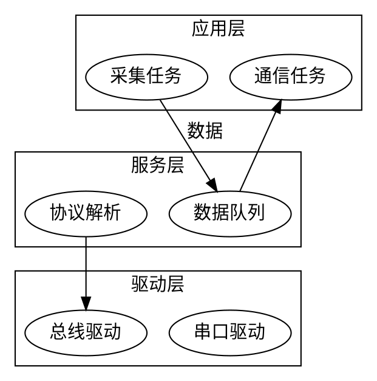
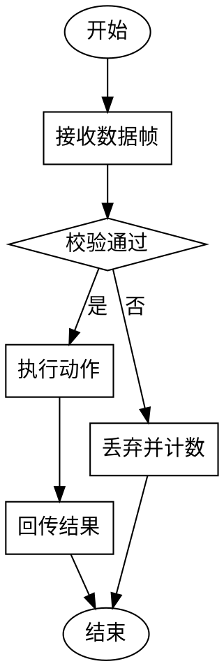
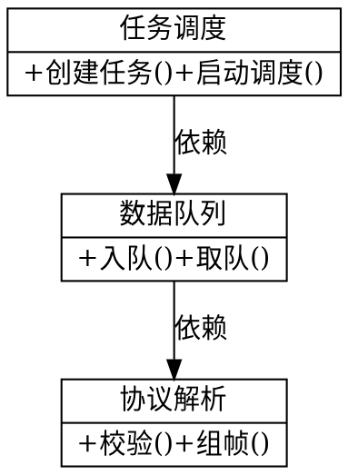

# 技术方案文档结构（无用户界面软件）

无用户图形界面的软件（嵌入式固件、驱动、库、后端服务、命令行工具等）不生成面向页面操作的操作手册，改生成技术方案文档。文档名称、软件名称和版本号使用当前登记软件的真实名称和版本，设计内容使用当前软件的真实设计方案，不照抄范本文案。

技术方案文档面向软著审核员和软件设计读者，采用传统设计说明书骨架：

```text
一、引言
二、软件总体设计
    2.1 软件需求概括
    2.2 需求概述
    2.3 条件与限制
    2.4 总体结构和模块接口设计
    2.5 模块功能逻辑关系
    2.6 设计和描述
        2.6.x 关键设计点（按项目实际命名）
三、软件功能描述
    3.x 真实功能（按项目实际命名）
四、接口设计
    4.1 软件界面
    4.2 API接口
        4.2.x 接口分组（按项目实际命名）
            4.2.x.y 单个接口：接口名称、接口说明、参数说明、返回结果
    4.3 出错处理设计
        4.3.x 出错处理机制（按项目实际命名）
```

## 章节内容要求

1. **引言**：说明本文档是对该软件静态和动态形态的描述、是软件编码过程中的指导文档。可补充一两句项目背景。
2. **软件需求概括**：先说明软件运行形态（运行在什么硬件/环境上、控制和连接什么），再用（1）（2）……列出主要功能，功能条目必须来自业务理解确认过的 `business_features`。
3. **需求概述**：逐条列出软件需要满足的需求（如运行在嵌入式环境中、控制某设备、完成某种数据处理）。
4. **条件与限制**：说明目标运行环境（芯片/操作系统）、开发环境（操作系统、交叉编译工具链）和编程语言。
5. **总体结构和模块接口设计**：描述软件整体结构、分层或部署形态、与硬件和其他软件的关系，并保留可见的【图预留】位置供插入结构框架图。
6. **模块功能逻辑关系**：用“模块名 / 功能描述”两列表格列出软件模块，模块必须与项目源码中的真实模块对应；表后可补充分层或依赖说明。
7. **设计和描述**：先总述主要功能的组织方式和数据流动，再按 2.6.x 分节写关键设计点；每个声明的流程图/类图保留可见【图预留】。
8. **软件功能描述**：按 3.x 分节，每个真实功能写它的设计说明和数据处理过程；声明的序列图/处理流保留可见【图预留】。
9. **接口设计**：
   - 软件界面：无界面软件写“无。”，不得编造界面。
   - API接口：按项目真实接口分组（如功能请求接口、数据传输接口、事件通知接口、串口协议、公开函数）。每个接口写接口签名、接口说明、参数说明表（序号/参数名称/类型/取值说明，无参数写“无。”）和返回结果。接口必须能在源码中回溯，不得编造。
   - 出错处理设计：分节描述事件通知、日志、异常恢复等机制。
10. **图预留**：技术方案文档不插入截图。架构图、流程图、类图、序列图统一使用可见的 `【图预留：请在此处插入“XX”流程图。】` 文字占位，正式 Word 中保持可见；用户可在 Word 中自行替换为真实图片。

## 图纸渲染（可选，graphviz）

模型可以在 `design_spec.figures` 中用 DOT 语言声明图纸，按插槽命名：

- `architecture`：软件整体结构框架图（2.4 节）。
- `key_1`..`key_N`：对应 `key_designs` 各关键设计点（2.6.x 节）。
- `function_1`..`function_N`：对应 `functions` 各功能（3.x 节）。

声明后运行 `scripts/render_design_figures.py`，脚本把 DOT 源渲染成 PNG 到 `软件著作权申请资料/草稿/图纸/`，生成 `图纸清单.json`，技术方案文档生成时按清单把图片嵌入正文（与操作手册截图走同一套 OfficeCLI 图片插入管线）。

## 渲染后端探测与回退

渲染器不假定任何单一工具可用，运行时按以下顺序探测可用后端（`dot -Tpng` → `dot -Tsvg` + cairosvg / inkscape / librsvg / imagemagick 任一可用转换器），逐张图按顺序尝试直到成功；`环境检查.json` 会记录首选后端，渲染时优先使用它：

- 环境检查阶段（`check_environment.py`）已经探测过一次完整链路，结果写入 `环境检查.md/json` 的“图纸渲染”条目，agent 和用户都能看到当前系统能出哪类图。
- 图渲染失败时不伪造成功：失败的图在 `图纸清单.json` 中标记 `error`，正文保留【图预留】占位，技术方案文档自检会提示。
- 所有后端都不可用时，渲染脚本给出当前平台的 graphviz 安装命令（`diagram_install_hint()`：Windows 用 winget/choco/scoop，macOS 用 brew，Linux 用发行版包管理器）。装好后重跑渲染脚本即可。
- 不声明 figures 时全部使用【图预留】占位，不依赖任何绘图工具。

## 排版质量保障

脚本和模型两侧共同保证出图排版清楚、不重叠、同级一致：

**脚本自动注入（无需模型操心）**：渲染前 `normalize_dot_source()` 在图源开头注入一套版式默认值（DOT 语义中模型自己的显式声明优先）：

- `graph [rankdir=TB, nodesep=0.45, ranksep=0.7, splines=ortho, fontname=<系统中文字体>, fontsize=12, bgcolor="white", pad="0.3", labeljust=l]`——`labeljust=l` 让 cluster 标题靠左，避免居中标题被跨层连线穿过；带边标签的图自动改用 `splines=polyline`（正交边不支持边标签，标签会错位）。
- `node [shape=box, style="rounded,filled", fillcolor="#F5F7FA", color="#4A6FA5", width=2.2, margin="0.18,0.1"]`
- `edge [color="#4A6FA5", fontsize=10, arrowsize=0.7]`

中文字体通过 `fc-list` 探测（Windows 默认微软雅黑、macOS 默认苹方），避免中文渲染成方框。渲染统一使用 150 DPI 保证 Word 中清晰；有 ImageMagick 时自动裁剪四周留白。graphviz 的渲染警告（如边标签错位提示）会转成建议写入 `图纸清单.json`。

**渲染前 lint（`lint_dot_source()`）**：

- 阻断级：标签单行超过 24 字未用 `\n`（或 HTML 标签缺 `<BR/>`）换行——这是节点被撑宽、图文重叠的首要原因，渲染直接失败并提示修正，正文保留【图预留】。
- 建议级（记录在 `图纸清单.json`，不阻断）：连线超过 12 条、标签文字超过 4 处、未指定 splines。
- 渲染后校验 PNG 宽高比，比值超过 3.5 记入清单提示布局失衡。

**模型侧规则**（写 DOT 时遵守）：

- 同级元素对齐：同一层的节点用 `{ 节点A; 节点B; 节点C; }` 或 `rank=same` 约束，保证横向/纵向对齐一致。
- 方向选择：正式 Word 是竖版 A4，流程图默认 `rankdir=TB`（自上而下）；`rankdir=LR` 只用于不超过 5 个节点的短链，横向长链插入竖版文档后文字不可读，会被宽高比校验拦下。
- cluster 标题位置：分层架构图默认 `labeljust=l`（标题靠左），避免居中标题被跨层连线穿过；带边标签的图自动改用折线边（正交边不支持边标签）。
- 分层配色一致：同一层节点用同一 `fillcolor`，不同层用不同浅色（如任务层 #F5F7FA、服务层 #E8F0E8、驱动层 #F0E8E8），层间用 `subgraph cluster_` 框起来。
- 标签换行：节点文字控制在 2～3 行、每行不超过 24 字，用 `\n` 显式换行；长说明移到正文，图里只留模块名和关键词。
- 控制密度：单张图节点不超过 12 个、连线不超过 12 条；内容多时按层拆成多张图（架构图、关键设计图、功能图分开）。
- 边标签精简：优先用正文说明数据流向，图上的 `label` 不超过 4 处，避免与节点重叠。

DOT 图源必须对应真实模块结构，常用写法：







DOT 语法要点：有向图用 `digraph`，节点连接用 `->`；子图名必须以 `cluster_` 开头才会渲染成框；含空格的节点 ID 要加引号；属性用逗号分隔。

## 写作规则

- 一级章节标题使用中文大写序号（一、二、三、四）；二级用 2.1、三级用 2.6.1、接口用 4.2.1.1 形式编号。
- 语言面向软件设计读者：与操作手册不同，本文档鼓励写清楚模块、数据流、算法要点、接口参数和错误处理等技术内容。
- 全文不得出现面向图形界面的词汇（页面、按钮、点击、弹窗、登录、输入框等）；软件行为用设备、模块、任务、接口的行为描述。
- 内容必须来自当前项目的真实设计（源码、README、设计文档、用户补充说明），不得编造不存在的模块、功能或接口。
- 软件名称和版本号与 `草稿/申请表信息.md` 保持一致；正式 Word 页眉与代码材料页眉一致。
- 无界面软件的申请表“软件分类”通常选择“嵌入式软件”（以用户确认为准）。
